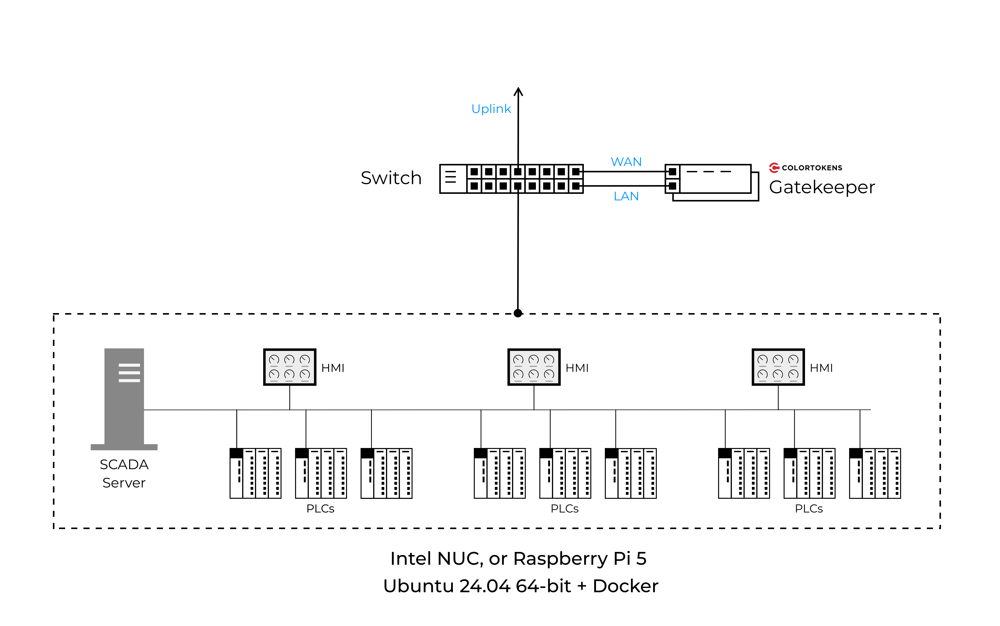
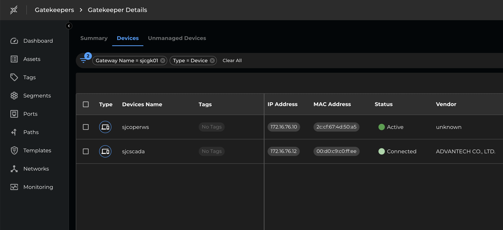

# Scada-in-a-Box

## Description

This lab-in-a-box emulates a small SCADA-based OT network and is designed to showcase ColorTokens Xshield microsegmentation in OT and other CPS (cyber-physical system) environments.

The setup runs entirely on a single low cost ARM or Intel/AMD Small Form Factor (SFF) computer.  The Raspberry PI 5 is perhaps the lowest-cost option and is fully tested.  An Intel NUC or equivalent is also a good option.

The host emulates the SCADA server, and the PLC and HMI devices are emulated by docker containers running on a specialized network that allows each container to have its own MAC address, and receive its IP configuration from the ColorTokens Xshield Gatekeeper.

## Setup Instructions

Pre-requisites

Procure the hardware and install the OS and Docker engine:

- [Ubuntu 24.04](https://ubuntu.com/download/server) - 64-bit, AMD64 or ARM64
- [Docker engine](https://docs.docker.com/engine/install/ubuntu/)

Prepare the host network

First we create a bridge interface, and we set the MAC address so it looks like a legit SCADA server.

    sudo ip link add name scada-br0 type bridge
    sudo ip link set scada-br0 address 00:D0:C9:C0:FF:EE

Next, attach the bridge to the LAN interface.

    sudo ip link set eth0 master scada-br0

Add local firewall rules to ensure forwarding

    sudo iptables -A FORWARD -i scada-br0 -j ACCEPT

Finally, get an IP address for the bridge from the Gatekeeper

    sudo dhcpcd -h sjcscada scada-br0

In a few minutes the bridge will appear in the Xshield console.  Note that your host is also here.

Install the docker networking plugin

We will now install a custom networking plugin that allows our containers to appear on the LAN as individual devices and use DHCP to request an IP from the Gatekeeper. This plugin was originally developed by [devplayer0](https://github.com/devplayer0/docker-net-dhcp). A small bug fix was provided in a [pull request](https://github.com/devplayer0/docker-net-dhcp/pull/43) and I compiled and built container images for ARM and Intel.  You can find these at [colortokenslabs/docker-net-dhcp](https://hub.docker.com/repository/docker/colortokenslabs/docker-net-dhcp/general)

To install the plugin on an **ARM** host (like the RPi 5), run this command:

    docker plugin install colortokenslabs/docker-net-dhcp:linux-arm64

You should see the following message:
<pre>
Plugin "colortokenslabs/docker-net-dhcp:linux-arm64" is requesting the following privileges:
 - network: [host]
 - host pid namespace: [true]
 - mount: [/var/run/docker.sock]
 - capabilities: [CAP_NET_ADMIN CAP_SYS_ADMIN CAP_SYS_PTRACE]
Do you grant the above permissions? [y/N]
</pre>

Answer "y" to proceed.  You can verify that the plugin has installed by running the following command:

    docker plugin ls

Your output should look like this:
<pre>
venky@sjcoperws:~$ docker plugin ls
ID             NAME                                          DESCRIPTION                          ENABLED
19bc739ba9ce   colortokenslabs/docker-net-dhcp:linux-arm64   Docker host bridge DHCP networking   true
</pre>

Now create the docker network for the containers:

    docker network create \
    -d colortokenslabs/docker-net-dhcp:linux-arm64 \
    --ipam-driver null -o bridge=scada-br0 scadanet

You should see the **scadanet** network as shown below:

<pre>
venky@sjcoperws:~$ docker network ls
NETWORK ID     NAME       DRIVER                                        SCOPE
baacad5d093a   bridge     bridge                                        local
0148eaa9306b   host       host                                          local
60c9e428dc34   none       null                                          local
fc0559f886ac   scadanet   colortokenslabs/docker-net-dhcp:linux-arm64   local
</pre>

If your host is based on an Intel/AMD 64-bit CPU, you will need to use the docker-net-dhcp plugin release tag *linux-arm64*.  So the commands will be:

    docker plugin install colortokenslabs/docker-net-dhcp:linux-amd64

and:

    docker network create \
    -d colortokenslabs/docker-net-dhcp:linux-amd64 \
    --ipam-driver null -o bridge=scada-br0 scadanet

Deploy devices

